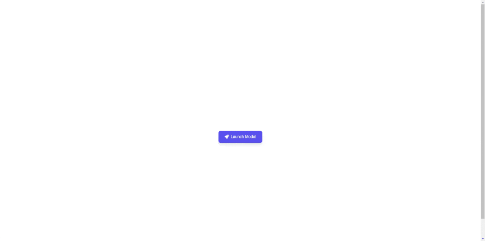
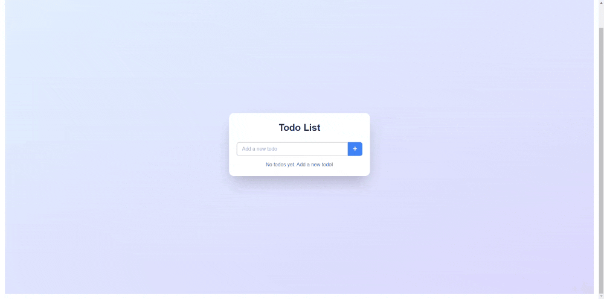

  An open source project that can generate React Components.

## Tech stack

- [Claude AI](https://www.anthropic.com/) Claude AI Models
- [Sandpack](https://sandpack.codesandbox.io/) for the code sandbox
- Next.js app router with Tailwind
- Prisma Postgress Database

## Examples Demo generated using ReactAI

- [Popup Modal](https://instantcode.vercel.app/share/_ajy9)

- [Newsletter Form](https://instantcode.vercel.app/share/qfhed)

- [Todo App](https://instantcode.vercel.app/share/nLQ1G)

- [Counter App](https://instantcode.vercel.app/share/EGzfh)

- [Calculator App](https://instantcode.vercel.app/share/SNSb3)

- [Image Generator](https://instantcode.vercel.app/share/gldbD)

- [Chat App](https://instantcode.vercel.app/share/450ym)

